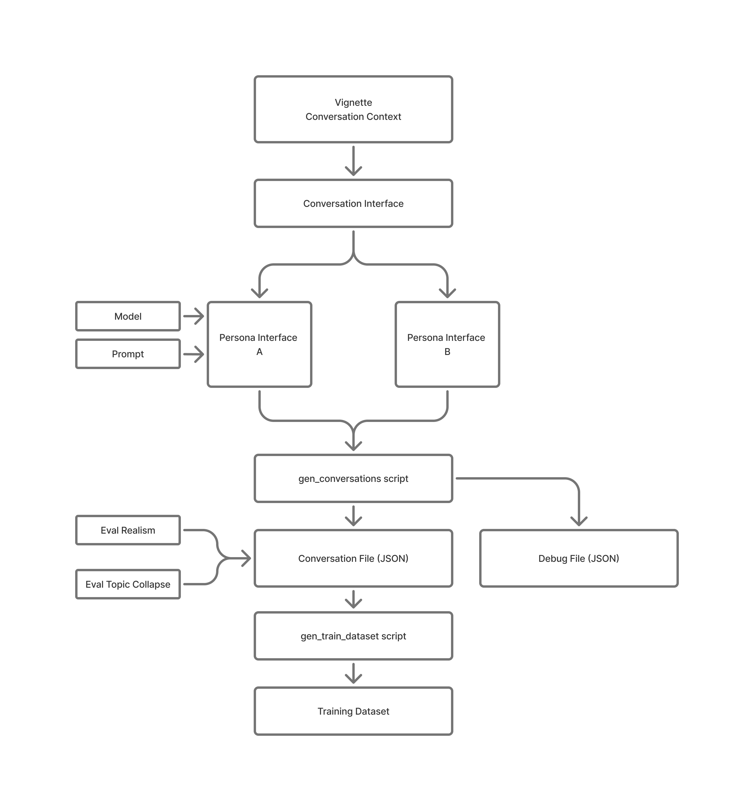

# Conversation Generator - Question/Answer Turns for Model Eval and Fine-tuning

Use for generating synthetic conversations for system testing, development, finetuning, training and all sorts of other tasks where synthetic personas conversing with each other are useful ;)

## Description
The process begins with a Vignette (Conversation Context) - a predefined scenario or setting that establishes the conversational framework and context for the synthetic dialogue. Store your vignette in the `vignette_library` directory.

*Persona Generation:* The vignette feeds into two distinct Persona Cards (A and B), which define specific LLM and Prompt. These cards define the characteristics, roles, and behavioral patterns of the two conversation participants. The choice of different models allows us additional flexibility. For example, using abliterated or specially fine-tuned local models to get closer to the persona parameters that we want.

Both persona cards feed into the gen_conversations script, which orchestrates the actual dialogue generation between the two synthetic personas based on their defined characteristics and the original vignette context.

The script produces a Conversation File (CSV) containing the generated dialogue exchanges.

*Dataset Compilation Step:* The conversation files can be processed through the `gen_train_dataset` script, which consolidates multiple conversation files into a structured format.
The pipeline culminates in a training dataset - a comprehensive collection of synthetic conversations formatted for machine learning model training, fine-tuning, or evaluation purposes.

## Generation Process

Validate that all of the conversation components are present and not mistakes in the setup where made
`python utils/interface_validator.py input_libraries/conversations/conversation_001.example.json`

Generate a conversation
`python gen_conversations.py --config input_libraries/conversations/conversation_001.example.json --turns 3 --count 2 --output-dir outputs/test_run --debug-prompts`

## TODO 

+ simplify interface validator
+ review modifier engine and strategies 
+ clean vignette directory
+ add explanation for opt-in nature of gitignore files
+ add human eval interface for realism
+ add token length param and test it with longer synthetic conversations
+ Explore implementation of repetition penalties (https://www.reddit.com/r/LocalLLaMA/comments/1g383mq/repetition_penalties_are_terribly_implemented_a/)
+ add testing for topic collapse 
+ refactor gen_train_dataset script to output to multiple training formats

## Single Conversation from a Vignette 
To process a single conversation, point the script at the specific vignette in the vignette library. 

`python gen_conversations.py --mode file --path ./vignette_library/choose_vignette.txt --turns 7 --times 2`

To process a list of files, point the scripts at the csv fomatted list of the vignettes

`python gen_conversations.py --mode csv --path ./vignette_library/vignette_list.csv --turns 2 --times 3`

You can run the batching script in two modes: file or csv --> 'file' for single file, 'csv' for processing files listed in a CSV
Use `--turns` flag to specify number of question and answer turns the speakers take within a generated dialog.
Use `--times` flag to specify how many times the specific vignette will be used to generate a dialog 

## Training dataset generator

Default behavior (no history, default timestamped output file.) All of the content in *output* directory located in distinct synthetic conversation CSV filews is packed into a single JSON file for traing an LLM or LoRA.
`python gen_train_dataset.py`

To test output on a single conversation file
`python gen_train_dataset.py --mode file --input /path/to/file`

Specify input and custom base name for output (no history)
`python gen_train_dataset.py -i /path/to/csv/files -o my_custom_training_data.json`

#### Todo:
Generate data with history (timestamped output file)
`python gen_train_dataset.py --history`

Specify all options with history and custom base name
`python gen_train_dataset.py -i /path/to/csv/files -o my_custom_training_data.json --history`

## Example datasets with and without histoy 

### No History
`{
  "instruction": "Explain the concept of photosynthesis to a 10-year-old.",
  "input": "",
  "output": "Photosynthesis is like a plant's way of making its own food. Imagine plants are like tiny factories. They take in sunlight, water from the soil, and a gas called carbon dioxide from the air. Using these ingredients, they create their own food, which is a type of sugar. It's kind of like how you might use ingredients to bake a cake, but plants do it using sunlight as their oven! This process also produces oxygen, which is great for us because we need it to breathe."
}`

### With History
`{
  "instruction": "Respond to the user's latest message.",
  "input": "What's your favorite color?",
  "output": "My favorite color is blue. I find it calming and reminds me of the sky and ocean. Do you have a favorite color?",
  "history": [
    {"role": "user", "content": "Hi there! How are you today?"},
    {"role": "assistant", "content": "Hello! I'm doing well, thank you for asking. How can I assist you today?"},
    {"role": "user", "content": "I'm just chatting. Tell me something about yourself."},
    {"role": "assistant", "content": "Well, as an AI assistant, I don't have personal experiences, but I'm designed to be helpful, friendly, and knowledgeable on a wide range of topics. Is there anything specific you'd like to know or discuss?"}
  ]
}
`